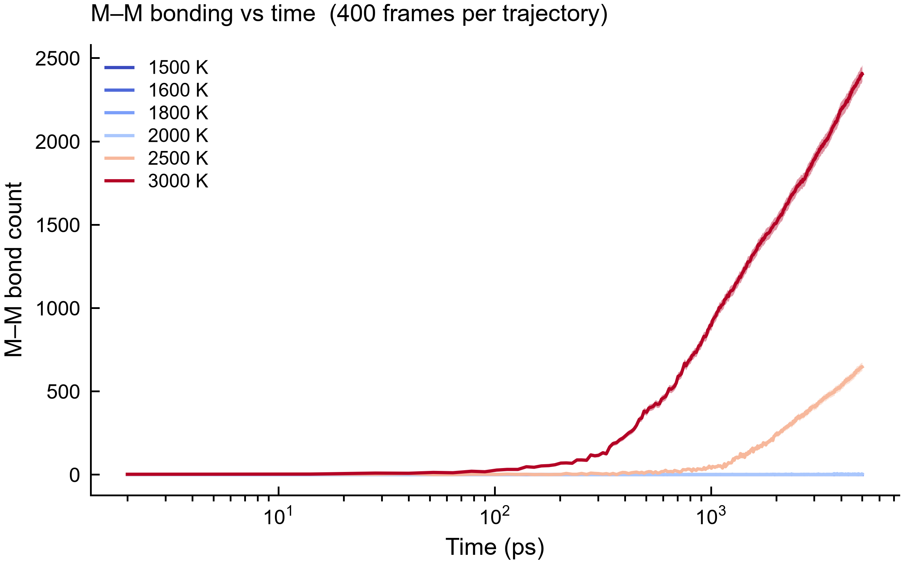

# Data Smoke Test（数据冒烟测试 Demo）

> **这个仓库是什么**  
> 面向全文分析流程的 **data smoke test**：验证随仓库提供的数值结果能否正确加载、
> 脚本能否跑通、能否在普通电脑上生成预期图件——**不需要** GPU、OVITO 或完整 MD 轨迹。
>
> **这个 case 是什么**  
> 这里放的是**其中一个代表 case**（金属–金属 / M–M bond 随时间演化）。  
> 完整 Methods 包里还有 entropy、contact ratio、bond angle、coordination 等；
> 冒烟测试的模式相同：小数据产品 + 一条命令 + 预期输出。

[](https://doi.org/10.5281/zenodo.22816324)

**完整原始脚本与数据（全部分析 case）：**  
DOI [`10.5281/zenodo.22816324`](https://doi.org/10.5281/zenodo.22816324) ·  
页面：[https://zenodo.org/records/22816324](https://zenodo.org/records/22816324)

本 GitHub 仓库只是 **data smoke test** 切片；全部 Methods 脚本在上述 Zenodo 记录中。

---

## 冒烟测试目标（通过标准）

| 检查项 | 通过标准 |
|--------|----------|
| 依赖安装 | `pip install -r requirements.txt` 成功 |
| 脚本运行 | `python plot_MM_bond_time.py --plot-only` 退出码 0 |
| 产出文件 | 写出 `MM_bond_time.png` / `.svg` / `.csv` |
| 耗时 | 普通桌面约 **1–3 秒** |
| 结果合理性 | 图中有 6 条温度曲线；高温曲线明显上升 |

满足以上即可认为：**该 case 的数据产品 + 作图链路**正常。

---

## 本仓库中的 Case（示例）

- **Case：** M–M bond 时间序列  
- **脚本：** `plot_MM_bond_time.py`  
- **原始数据：** `MM_bond_time_data.npz` / `MM_bond_time_data.csv`  
- **参考图：**



英文版：[`README.md`](README.md)。方法细节：[`MM_bond_time_methods.md`](MM_bond_time_methods.md)。

---

## 如何运行

```bash
git clone https://github.com/JiaaoWANG-ut/data-smoke-test.git
cd data-smoke-test

python -m venv .venv
# Windows: .\.venv\Scripts\Activate.ps1
# Linux/macOS: source .venv/bin/activate
pip install -r requirements.txt

python plot_MM_bond_time.py --plot-only
```

预期终端输出：

```text
Saved: .../MM_bond_time_data.csv
Saved: .../MM_bond_time.png
Saved: .../MM_bond_time.svg
```

安装通常 **1–3 分钟**；冒烟运行通常 **1–3 秒**。

---

## 仓库内容

| 路径 | 说明 |
|------|------|
| `plot_MM_bond_time.py` | 本 case 脚本（从缓存出图） |
| `MM_bond_time_data.npz` / `.csv` | ★ 本 case 原始数值产品 |
| `MM_bond_time.png` / `.svg` | 参考输出 |
| `example_gpumd_run/` | 示例 GPUMD 输入 / thermo |
| `requirements.txt` | 最小依赖 |

> 完整 `dump.xyz` 不在本仓库。冒烟测试只依赖已缓存的 NPZ/CSV。

---

## 数据列说明（本 case）

| 列 | 类型 | 含义 |
|----|------|------|
| `temperature_K` | int | 模拟温度 (1500, 1600, 1800, 2000, 2500, 3000) |
| `time_ps` | float | 帧时间 (ps) |
| `frame_index` | int | 原 2500 帧轨迹中的帧号 |
| `n_pure` | int | 计入 M–M bond 的金属原子数 |
| `n_err` | float | 不确定度 σ = √n_pure（Poisson） |

示例（1500 K 前几行接近 0）：

```csv
temperature_K,time_ps,frame_index,n_pure,n_err
1500,2.000000,0,0,0.000000
1500,14.000000,6,0,0.000000
```

```python
import numpy as np
d = np.load("MM_bond_time_data.npz", allow_pickle=True)
print(d["temperatures"], d["3000_n_pure"].max())
```

### 本 case 结果 sanity check

| T (K) | 典型 `n_pure` 行为 |
|------:|-------------------|
| 1500–2000 | 多数/全部帧接近 0（氧化物局域壳层为主） |
| 2500 | 后期上升（量级约 10²–10³） |
| 3000 | 更早、更强上升；末期可达 ~2000+ |

---

## 命令

| 命令 | 是否属于 smoke test |
|------|---------------------|
| `python plot_MM_bond_time.py --plot-only` | **是（推荐）** |
| `python plot_MM_bond_time.py --force` | 否（从 dump 重算，需 OVITO + 轨迹） |

---

## 与完整代码包的关系

完整原始脚本（全部 case）归档于 Zenodo：

- **DOI：** [10.5281/zenodo.22816324](https://doi.org/10.5281/zenodo.22816324)
- **页面：** [https://zenodo.org/records/22816324](https://zenodo.org/records/22816324)

```text
Zenodo → Methods/
  entropy/               ← 其他 case
  contact ratio/         ← 其他 case
  bond angle analysis/   ← 其他 case
  coordination number/   ← 其他 case
  M-M bonds/             ← 本仓库隔离出的 smoke-test case
```

后续可为其他 case 按同样方式增加冒烟测试：小数据 + 一键命令 + 预期文件/耗时。

---

## 引用

- 完整脚本 Zenodo：[10.5281/zenodo.22816324](https://doi.org/10.5281/zenodo.22816324)  
  ([https://zenodo.org/records/22816324](https://zenodo.org/records/22816324))
- 以及相关论文

---

## 常见问题

| 现象 | 处理 |
|------|------|
| 缺依赖 | `pip install -r requirements.txt` |
| 缺 NPZ | 从 git 恢复 `MM_bond_time_data.npz` |
| 报缺 ovito / dump | 继续用 `--plot-only`（这才是 smoke test） |
